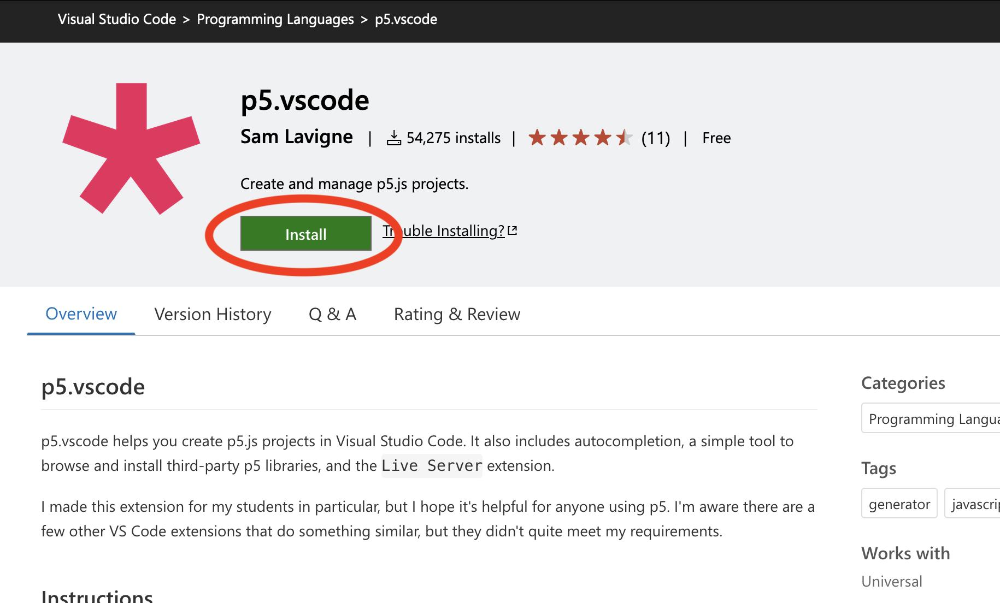
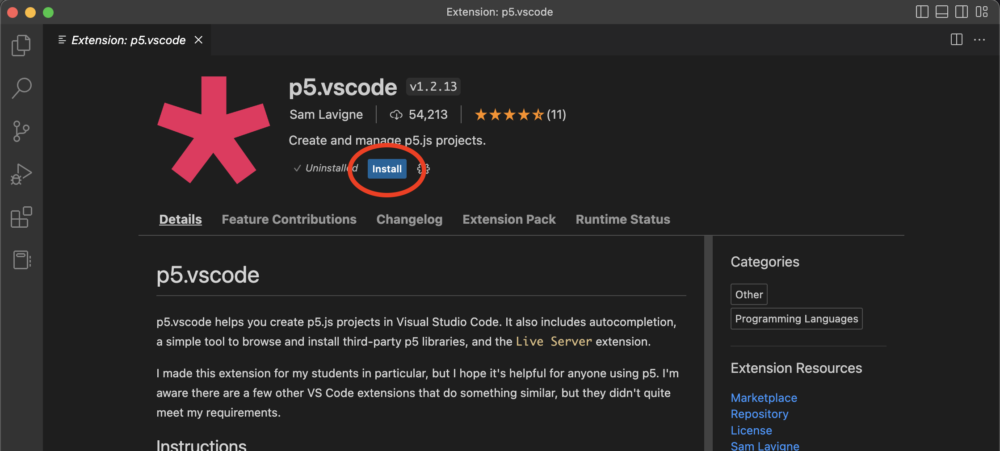
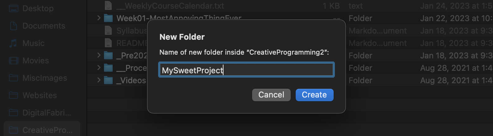
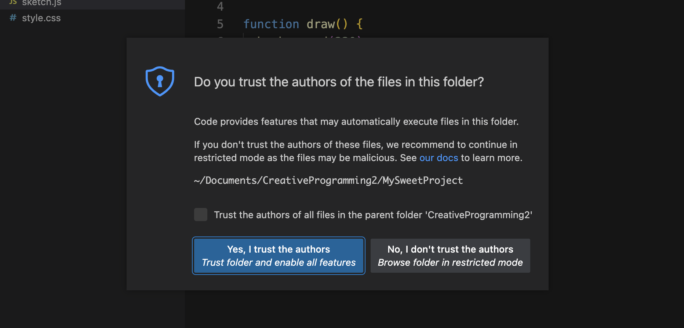
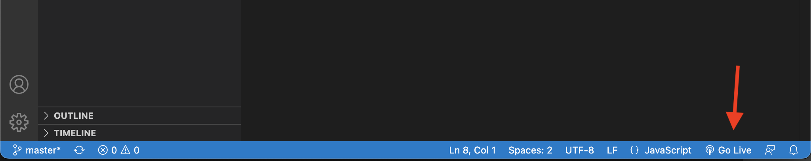

# USING AN EXTERNAL EDITOR  
The `p5.js` online editor is awesome: it's a quick and easy way to start coding, it lets you share your projects easily, and it takes no effort to get it working. But it has some serious limitations too: everything has to fit on one screen, no auto-complete or color themes, and upload limits.

There are lots of options, but this semester we'll use Visual Studio Code (hereafter just called *"Code"*) but there are many other ways to do this! Finding a workflow that's right for you can be an endless rabbit hole and this is just one way of working, but if you're just transitioning from the online editor this should help you get started. Experiment and see what works for you!

- - -

### CONTENTS
Jump ahead using these links or start from the beginning:

* [Install the `p5.vscode` extension](#install-the-p5vscode-extension)  
* [Create a project](#create-a-project)  
* [Preview in browser](#preview-in-browser)  

- - -

### INSTALL THE `p5.vscode` EXTENSION
One of the super cool things about Code is that we can install extensions – tools that expand the ability of the application and make coding easier! This semester, we'll use [Sam Lavigne's excellent `p5.vscode`](https://marketplace.visualstudio.com/items?itemName=samplavigne.p5-vscode) which not only gives us fancy stuff like syntax highlighting for `p5.js` commands, it also can create projects for us and can even install libraries.

There are a few ways to install the extension, but the easiest is to [go to the extension's page](https://marketplace.visualstudio.com/items?itemName=samplavigne.p5-vscode) and click `Install...`

This will open Code to the extension's page. Click `Install` (again, I know) and in a few seconds you'll be all set!

- - -

### CREATE A PROJECT
As you've seen in the online editor, a `p5.js` project needs several files to run. The extension will quickly create all those files for us and will be up to date!

Go to `View > Command Palette...` or `Command/control + Shift + P`

Type in `Create p5.js Project` (or just hit enter when that option shows up). You'll then be prompted to point your computer to a blank folder where the project should go.

If you don't already have a folder, you can make it now! Lastly, you'll be asked if you trust the files in this folder. Since you made them, I hope so!

Your project will now be open in Code and you can navigate between files easily!

- - -

### PREVIEW IN BROWSER  
Having your code is great but not that useful if we can't see what it creates. A huge benefit of Code is the `Live Server` tool ([you may have to install it here](https://marketplace.visualstudio.com/items?itemName=ritwickdey.LiveServer)). To enable it, be sure your project is open in Code, then click the `Go Live` button at the very bottom:

Your default browser should open, showing you your project! 

> 🙋‍♀️ But where's the console?! 

We rely on the console for catching errors, seeing the state of our code, and lots of other things. It's built in to the online editor, but really easy to find in the browser too. The menu location/shortcut will vary depending on your browser:

* Firefox: `Command/control + option + I`  
* Chrome: `Command/control + option + J`  
* Safari: is [a bit more complicated](https://support.apple.com/guide/safari/use-the-developer-tools-in-the-develop-menu-sfri20948/mac)  

You'll also notice way more tools in these consoles than the online editor!

A few other interesting things...

1. Code also includes auto-reload. If you save any file in your project, the browser reloads automatically. This is waaaay nicer than manually refreshing every time  
2. You don't have to be online! Notice the weird URL, something like `http://127.0.0.1:5500/`? That's a local IP address, meaning you can work without an internet connection but your project will behave the same when on a server. Depending on your network, you can put this URL into the address bar on another device using the same network to preview it there too! (You may need to do some extra steps, [outlined here](https://github.com/ritwickdey/vscode-live-server/blob/HEAD/docs/faqs.md#how-to-access-the-server-from-mobile))

When you're done working, click the button (which now says something like `Port: 5500`) to close the server.

