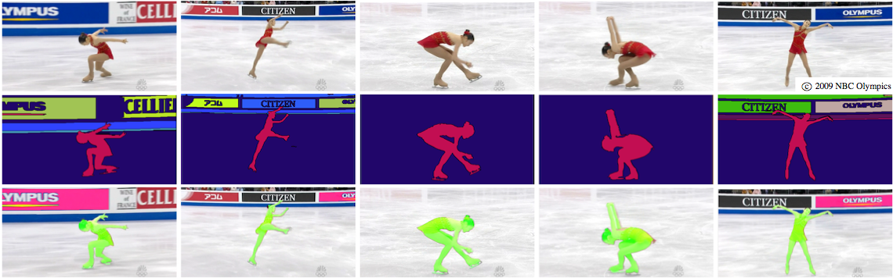

# TRACKING

### TLDR  
* Project that uses tracking to create an interactive experience  
* For Thurs, March 11:  
  * At least 10 project sketches (digital or in your sketchbook)  
  * Rough version of your code with tracking working  
* For Thurs, March 18:  
  * A repository with your project's code  
  * A `README` file in your repo, including:  
    * A description of your project  
    * Three screenshots of it running  
  * Upload link to repo in Canvas

***

### ASSIGNMENT 

We've now looked at how to traverse the pixels in an image and manipulate them in different ways. The field of [Computer Vision](https://en.wikipedia.org/wiki/Computer_vision) (CV) all about using those pixels to extract information from images, whether that be the location of faces, analysis of a person's [gait](https://books.google.com/books?id=uClKDwAAQBAJ&pg=PT226&lpg=PT226&dq=computer+vision+identification+gait+stone+in+shoe&source=bl&ots=NBR0nFC6DL&sig=ZdH74-NGOj-sWCbV9MBM8tbFkmQ&hl=en&sa=X&ved=0ahUKEwjD_-mbnqPZAhVJwlkKHeBABcMQ6AEIKTAA#v=onepage&q=computer%20vision%20identification%20gait%20stone%20in%20shoe&f=false) or [emotional state](https://www.affectiva.com/emotion-ai-overview/), [identifying objects](https://www.kaggle.com/c/cifar-10) in a scene, and [self-driving cars](https://media.giphy.com/media/GQZ0ajY3o5tS/giphy.gif). These technologies are increasingly embedded (and often unseen) in our devices and tools, and are used in contexts ranging from taking better selfies to surveillance and military technologies... and can be used to make interactive art!

Your assignment is to explore computer vision in a way that is visual, creative, poetic, and/or critical of those tools. You can use color tracking, optical flow, or object detection (we'll get to face and skeleton tracking next, so please hold off on that for now!). 

Some things to think about:  
* What do you track: an everyday object, custom-made object that's part of the visual experience  
* Is that object a conceptual/poetic part of the piece or a tool like a mouse  
* What format/audience you want your project to engage: a game for a brand, an interactive visual experience for a gallery, etc  
* Can you use other topics we've covered: randomness, collage, etc  
* Or non-code processes: hand-drawn images, graphics created in Illustrator, photographs  

A technical aside: our brains are really good at seeing patterns and extracting objects using data from our eyes (about 30% of the cortex is used for visual processing, while only 8% for touch and 3% for hearing). You may at times find yourself frustrated that the computer glitches while tracking colors or identifying objects: remember how bananas it is that it can do this at all!

***

### INSPIRATION  
* David Bowen's [*Cloud Tweets*](http://www.dwbowen.com/cloud-tweets) and [*Fly Carving Device*](http://www.dwbowen.com/fly-carving-device)  
* Chris Milk's [*The Treachery of Sanctuary*](http://milk.co/treachery)  
* Rafael Lozano-Hemmer's [*Bifurcation*](http://www.lozano-hemmer.com/bifurcation.php) and [*People on People*](http://www.lozano-hemmer.com/people_on_people.php)  
* Philip Schütte/Random Studio's [*SUN*](https://www.creativeapplications.net/js/three-js/sun-suns-cycle-as-an-interactive-playful-experience/)  
* Philip Worthington's [*Shadow Monsters*](https://www.moma.org/calendar/exhibitions/1321) (see also [this image](https://cdn.hpm.io/wp-content/uploads/2015/06/21113000/shadow3.jpg) that shows a bit about how th piece works)  
* [*Messa di Voce*](http://www.flong.com/projects/messa/), a performance by Jaap Blink with interactive visualizations by Golan Levin, Zach Lieberman, and Joan La Barbara  
* Golan Levin and Kyle McDonald's [*Eyeshine*](http://www.flong.com/projects/eyeshine/) and [*Augmented Hand Series*](http://www.flong.com/projects/augmented-hand-series/) (with Chris Sugrue)  
* David Rokeby's [*Giver of Names*](http://www.davidrokeby.com/gon.html)  
* This pretty fun [Harry Potter World wand](https://www.youtube.com/watch?v=iKUC0EbHw20), which lets you control things around the park (using infrared blob tracking!)  
* Adam Harvey's [visualization of how face detection in OpenCV sees a face](https://vimeo.com/12774628) 

- paul pfeiffer basketball piece
https://www.npr.org/sections/allsongs/2017/10/13/557324946/how-dan-deacon-collaborated-with-rats-to-make-his-latest-film-score
https://projectfoyer.com/kadewe/

cams for tracking
- https://www.sparkfun.com/products/14392
- https://www.sparkfun.com/products/14632

***

### RESOURCES  
* The ever-helpful Daniel Shiffman has a great tutorial on [blob tracking](https://www.youtube.com/watch?v=ce-2l2wRqO8), and one where the [blobs persist even when lost temporarily](https://www.youtube.com/watch?v=r0lvsMPGEoY)  
* Writeup on [computer vision in art](http://www.flong.com/texts/essays/essay_cvad/), including some sample code, from Golan Levin  
* A nice, simple [tutorial that explains one method for blob detection](https://www.learnopencv.com/blob-detection-using-opencv-python-c/) using several thresholded versions of the input image  
* Lots more (mathy) explanations on [Wikipedia](https://en.wikipedia.org/wiki/Blob_detection)  
* And some (mathy) ways to do [better blob-centroid finding](https://blog.mapbox.com/a-new-algorithm-for-finding-a-visual-center-of-a-polygon-7c77e6492fbc)  
* Get yourself ready for blobs by watching the [1958 movie of the same name](https://en.wikipedia.org/wiki/The_Blob)  

