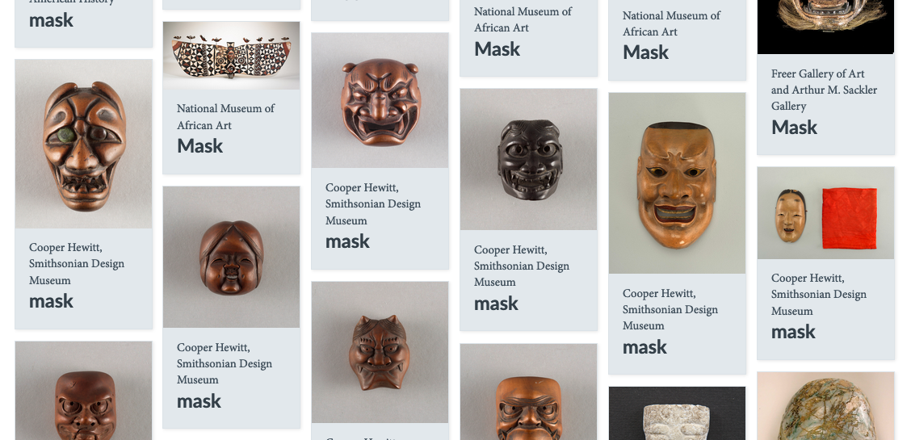

# MASK  

### TLDR  
* Create a mask that uses symbols to explore your identity  
* Use face tracking (and, optionally, skeleton tracking)  
* [For Thurs, March 25](#for-thurs-march-25):  
  * List 30 things your mask might show    
  * Pick at least three things from that list, come up with ways to add them to your mask  
  * Make a drawing of your mask, using annotations as needed  
  * Read *The Biography of a Painting* and *Introducing Myself*  
* [For Thurs, April 1](#for-thurs-april-1):  
  * Finish project  
  * Screen recording of you project running  
  * Create Github repo with `README`, screenshot, link to your recording, and description of the project and imagery used  

***

### ASSIGNMENT  

> "Who sees the human face correctly: the photographer, the mirror, or the painter?"  – Picasso

> "Do I contradict myself? / Very well then I contradict myself, / (I am large, I contain multitudes.)"   – [Walt Whitman](https://poets.org/poem/song-myself-51)  

For our next project, we'll use face tracking to create a digital mask that is a self-portrait. Overlaid in realtime using [`tensorflow.js`](https://www.tensorflow.org/js) and `p5.js`, your mask should talk about your identity while being a visually rich experience. You'll think about who you are and what things are core to your identity: your personality, background, interests, values, gender/sexuality, and/or anything else that you want to share.

The approach you take is up to you: your mask might be made of shapes drawn in code, a collage of images (or even videos!) on top of your face, typography, or some combination. Elements can be static or respond to your movements or even be interactive using your face. You might cover portions of your face or reveal others. The goal here is to not just think about making a visually cool project but one where your aesthetic decisions come together to tell a story about how you see and present yourself to the world.

*Above: a selection of masks from different cultures in the [Smithsonian collection](https://www.si.edu/search?edan_q=mask&)*

***

### CODE EXAMPLES/VIDEOS  
* [Video tutorials for this week](https://youtube.com/playlist?list=PLsGCUnpinsDn5WMcmiicRyOlCgU3agqwN)  
* [Code examples in the `p5.js` Editor](https://editor.p5js.org/jeffThompson/collections/VskQ3eqyz)

***

### FOR THURS, MARCH 25  
This week, you should spend time thinking about what parts of your identity you want to show us and how you will do so. We are all complicated, made of many interconnected (and sometimes contradictory) parts. One of the beautiful things about art is that it can contain all those things.

Start by listing everything you can about yourself, aiming for at least 30 things – we won't share these lists with the group. From this list, identify at least three things you want your mask to show and, for each one, come up with ways you can display them as part of your mask. What you choose to tell us about your identity is up to you as is the extent to which those things are clear to us: symbols, metaphors, and oblique references are all options if you prefer not to be entirely direct with the viewer. Think too about ways that these things might move, change, or interact as your face moves.

With your symbols/objects figured out, make a drawing of what you want your mask to look like. Be as detailed as possible – this is a great way to work out your ideas before diving into code. Annotations like arrows, labels, etc can help explain your ideas. When you're done, photograph your drawing (if it's analog) and upload to Canvas. If you have time, you can also start prototyping your mask in code.

Please also read *The Biography of a Painting* by Ben Shahn (1957) and *Introducing Myself* by Ursula Le Guin (ca 1980s). Both pieces talk about developing imagery, symbols, and ideas in ones' work.

***

### FOR THURS, APRIL 1  
\[ coming soon \]

***

### INSPIRATION  
* Historical mask collections:  
  * [V&A](https://collections.vam.ac.uk/search/?q=mask)  
  * [Smithsonian](https://www.si.edu/search?edan_q=mask&)  
  * [Met](https://www.metmuseum.org/art/collection/search#!?q=mask)  
* Nick Cave's [*Soundsuits*](https://art21.org/artist/nick-cave/) series  
* Tony Oursler's many works involving video and faces, including [*A\*gR_3*](https://tonyoursler.com/agr_3-madrid), his [show at Lehman Maupin in 2015 (includes some videos of the pieces running)](https://tonyoursler.com/lehmann-maupin-new-york), and [*Classifier Cascades*](https://tonyoursler.com/classifier-cascades-greece)   
* [*Human Traits*](http://patricktresset.com/new/project/human-traits-2015/) by Patrick Tresset  
* Lorna Simpson's [*Easy to Remember*](https://vimeo.com/91549843)  
* Andrea Gagliano's [*Madam President*](https://andrea-gagliano.com/madam_president.html)  
* Coralie Vogelaar's [*Emotions from an Algorithmic Point of View*](https://www.coralievogelaar.com/performance.html) and [*Random String of Emotions*](https://www.coralievogelaar.com/Random.html)  
* Some really great projects by Rafael Lozano-Hemmer, including [*Blow Up*](http://www.lozano-hemmer.com/blow_up.php) and [*Zoom Pavilion*](http://www.lozano-hemmer.com/zoom_pavilion.php)  
* [*CV Dazzle*](https://cvdazzle.com/) by Adam Harvey
* [*Facial Weaponization Suite*](http://www.zachblas.info/works/facial-weaponization-suite/) and [*Face Cages*](http://www.zachblas.info/works/face-cages/) by Zach Blas  
* Matthew Plummer-Fernandez's eerie [*Unique Visitors*](http://unique-visitors.tumblr.com/) breeds random 3D faces until they are recognized by OpenCV  
* Jason Salavon's [*The Class of 1988 & The Class of 1967*](http://www.salavon.com/work/Class/) and [*Portrait*](http://www.salavon.com/work/Portrait/)  
* Heather Dewey-Hagborg's [*Stranger Visions*](http://deweyhagborg.com/projects/stranger-visions), where she collected gum and other trash from public spaces in NYC, extracted the DNA, and reconstructed 3D faces  
* [*Face Maker* app](http://prostheticknowledge.tumblr.com/post/169232693186/face-maker-ios-app-by-tim-sears-for-iphone-x-lets) by Tim Sears  
* Using only darkroom technology, Nancy Burson's [*Composite Silver Prints*](http://nancyburson.com/composite-silver-prints/)  
* [*Cheese*](http://christianmoeller.com/Cheese) by Christian Moeller, which asks viewers to smile as long as possible  
* Daito Manabe's [*Face Projection*](http://www.daito.ws/en/work/face-projection.html#5) experiments  
* Google Creative Lab's [*Move Mirror*](https://experiments.withgoogle.com/move-mirror)  
* The super weird painting [*The Jurist*](https://en.wikipedia.org/wiki/The_Jurist_(painting)) from 1566 by Guiseppe Arcimboldo, which shows a figure made out of raw chicken, fish, and a pile of books  
* More in this week's `Images` folder!  

***

### RESOURCES  
* Webcams are great, but other cameras offer different forms of interaction:  
  * [Pixy2, a camera with built-in object detection](https://www.sparkfun.com/products/14392)  
  * [OpenMV, another camera with computer vision capabilities](https://www.sparkfun.com/products/14632)  
  * [An amazing guide to cameras for installations from Blair Neal](https://github.com/laserpilot/Guide_To_Cameras_Interactive_Installations)  
* Find lots of other face-related projects by [searching Prosthetic Knowledge](http://prostheticknowledge.tumblr.com/tagged/face)  
* And [another great list](https://github.com/kylemcdonald/AppropriatingNewTechnologies/wiki/Faces-in-Media-Art) from Kyle McDonald  
* Some of these references are a bit out of date, but [Daniel Shiffman's workshop Face It](https://github.com/shiffman/Face-It) has some great resources and examples  
* A lot of vision research points to our sight being driven by contrast, much like the edges in neural networks. For example, [this article on toad vision](https://en.wikipedia.org/wiki/Feature_detection_%28nervous_system%29#In_toad_vision), which links to [this bananas video](https://av.tib.eu/media/15148#t=0,00:25)  
* Do you see faces in random objects? It's a phenomenon called [pareidolia](https://en.wikipedia.org/wiki/Pareidolia)  

***

### BIAS AND AI  
An important conversation 

* [*Artificial Intelligence's White Guy Problem*](https://www.nytimes.com/2016/06/26/opinion/sunday/artificial-intelligences-white-guy-problem.html) by AI Now Institute/Microsoft Research's Kate Crawford  
* [*Mathwashing, Facebook, and the Zeitgeist of Data Worship*](https://technical.ly/brooklyn/2016/06/08/fred-benenson-mathwashing-facebook-data-worship/), an interview with former Kickstarter data scientist Fred Benenson  
* [*The Unreasonable Effectiveness of Recurrent Neural Networks*](http://karpathy.github.io/2015/05/21/rnn-effectiveness/) by machine learning guru Andrej Karpathy  
* [*What a Machine Learning Tool that Turns Obama White Can (and Can't) Tell Us About AI Bias*](https://www.theverge.com/21298762/face-depixelizer-ai-machine-learning-tool-pulse-stylegan-obama-bias) by James Vincent  
* [A post on Twitter's auto-cropping algorithm](https://hackaday.com/2020/09/23/community-testing-suggests-bias-in-twitters-cropping-algorithm)  

