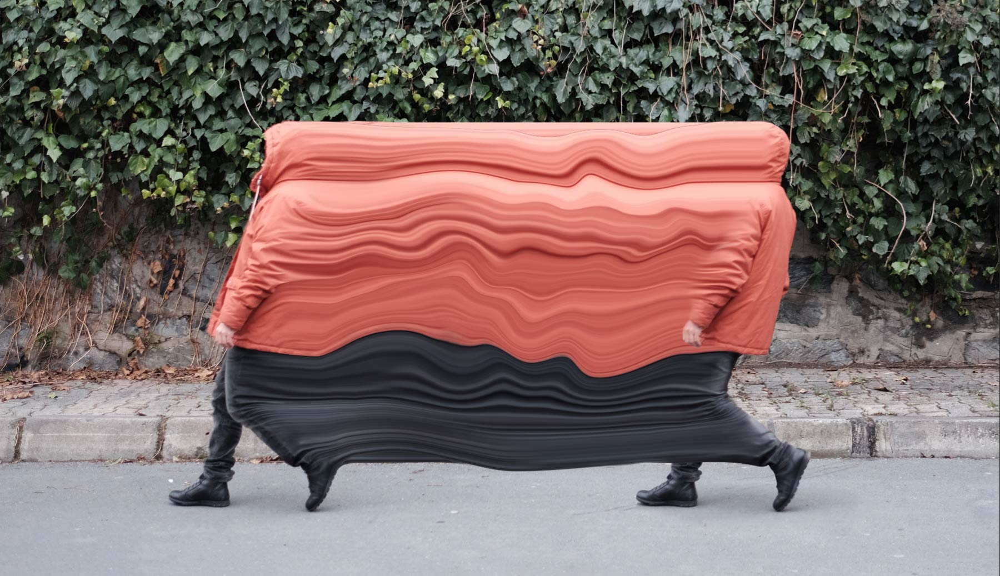

# IMAGE FILTERS

### TLDR  
* Due April 11  
  * April 4: [project template, still image exploratory studies, what do you want to learn next?](Part01-ExploratoryStudies.md)  
  * April 11: finish project  
    * Export processed frames to a folder  
    * We'll convert them to video using `ffmpeg` in class  
* Create an image filter, focusing on pixel manipulation  
* Formatted for Instagram stories and/or TikTok  
  * Add UI overlay on top of your output images  

***

### ASSIGNMENT  
In 1990, Adobe released version 1.0 of Photoshop, a new image-manipulation software that would become so ubiquitous that its name would is used as a verb. In that first official release, Photoshop included filters, algorithms that could go beyond adjusting a photograph and do fun things like blur and image or make it look like a pencil drawing. (Or you could just [run all of the filters](https://www.mentalfloss.com/article/19616/every-photoshop-filter) on one image.) Later, platforms like Instagram, Snapchat, and Tiktok would employ more complex filters to make a photo look vintage, smoosh your face, and make super weird images with [slit scanning](https://en.wikipedia.org/wiki/Slit-scan_photography). This week, we'll explore images "under the hood," looking at how to view  the pixel values of an image, then find creative ways to manipulate those pixels to make our own filters.

For this project, your assignment is to create the weirdest, most interesting, far-out filter you can! These should be designed to work with video for Instagram reels and/or TikTok, though you can prototype using a still image. Your code should load a video, go through each frame and do something interesting using its pixels, and save the result. While you can definitely get inspired by existing filters, you should focus on creating something that's your own. Try to work in an exploratory way: experiment and see what starts to emerge! Feel free to add other elements if you want, but the main focus of the project should be on pixel-level manipulation.

*Above: a "liquify" example from the Adobe blog by Şakir Yildirim from his "Crawler" series*

***

### CODE EXAMPLES/VIDEOS  
* [Video tutorials for this week](https://youtube.com/playlist?list=PLsGCUnpinsDkDT1Kr4oy5tmpd2N3LP9qJ)  
* [Code examples in the `p5.js` Editor](https://editor.p5js.org/jeffThompson/collections/lImWSKT1-)  
* Don't forget the [collage stuff we covered in CP1](https://github.com/jeffThompson/CreativeProgramming1/tree/master/Week06_Collage), which might also be helpful here  

***

### INSPIRATION  
* The early-20th-century painting movement [*Pointillism*](https://en.wikipedia.org/wiki/Pointillism), such as [this amazing painting by Paul Signac](https://en.wikipedia.org/wiki/Paul_Signac#/media/File:Paul_Signac,_1893,_Femme_%C3%A0_l'ombrelle,_oil_on_canvas,_81_x_65_cm,_Mus%C3%A9e_d'Orsay.jpg)  
* [Chuck Close's](https://www.pacegallery.com/artists/chuck-close) decades-long exploration of portraiture and fragmentation (note: in 2017, [several women claimed](https://hyperallergic.com/420538/four-more-women-allege-sexual-misconduct-by-chuck-close/) Close sexually harassed them, [see also](https://www.theguardian.com/artanddesign/2018/feb/15/chuck-close-art-sexual-harassment-pafa))  
* [*Civil Rather Than Military*](https://www.pacegallery.com/exhibitions/li-songsong-8) by Li Songsong  
* [*Liquify Filter*](https://helpx.adobe.com/photoshop/how-to/liquify-filter-motion-effects.html) by Sakir Yikdirim  
* [*Filler*](https://pixlpa.com/filler) by Andrew Benson, created using [WebGL](https://en.wikipedia.org/wiki/WebGL)  
* [*s8-grn-1a*](https://vimeo.com/305185958) and [*Flexible Pixels*](https://bengrosser.com/projects/flexible-pixels) by Ben Grosser  
* Intro to the [*Show Us Your Junk*](https://youtu.be/NwkF3-JmSeA?t=29) Youtube series  
* [Some cool examples of glitchy videos](https://glitchart.com/bpmc-players-ball-08-17) from Glitchart.com  

***

### RESOURCES  
* PDF of *The Pocket Handbook of Image Processing Algorithms in C* by Harley Mylser and Arthur Weeks in the `Readings` folder – not super easy to read but a great resource (Ling Dong has created an [amazing port of this book to Processing!](https://github.com/LingDong-/Processing-Demos-for-The-Pocket-Handbook-of-Image-Processing-Algorithms))  
* For a deep, mathy take, see [*An Interdisciplinary Introduction to Image Processing: Pixels, Numbers, and Programs*](https://mitpress.mit.edu/books/interdisciplinary-introduction-image-processing) by Steven L. Tanimoto  
* [Interesting video on computational photography](https://www.youtube.com/watch?v=PIbeiddq_CQ) from Nat and Friends  
* [More image filter tutorials](https://idmnyu.github.io/p5.js-image/Filters/index.html) from Crystal Chen and Paolla Bruno Dutra  
* You can [view the source code of the original Photoshop release](https://web.archive.org/web/20140507131754/http://www.computerhistory.org/atchm/adobe-photoshop-source-code/)  
* Scientific imaging software can be great, both for processing images and for getting ideas: [Fiji, the GUI version of ImageJ](https://fiji.sc/), is a good place to start  

