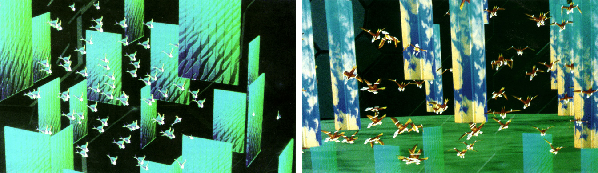

# SIMULATION  

### TLDR  
* Create a project that simulates or is inspired by a natural system  
* [April 8](Part1-ResearchAndMVPDocument.md): research, drawings, MVP document  
* April 15: prototype your project in code  
* April 22: finish project, record video, `Final Project` ideation  

⚠️ Since this is a multi-week project, details for each week are in separate files! Links in the TLDR section above ⚠️

***

### ASSIGNMENT   

> "I think that my job is to observe people and the world" – Haruki Murakami  

> "If you know everything about a given metropolis, from its plumbing standards to its parking requirements, its sewer capacity to the borders of its school districts, then you coud more or less accurately imagine the future form of that city from the ground up." – Michael Sorkin on the game *Sim City*  

For our last regular project of the semester, we'll turn to the natural world for inpsiration. The goal is to bridge research, observation, and the "real world" (aka things outside the computer) with code. You should first pick a natural system of some kind (an animal, plant, environmental process, weather, etc) and observe it very carefully. From there, you'll think about how to translate that to code, adding as many little details as you can. The output doesn't need to mimic or precisely simulate your chosen subject, but can either be a careful a reproduction of that system as best you can or a work that is inspired by its details.

Some examples:  
* Observe the way snow falls in the breeze and ways snowflakes form &rarr;create a piece that generates a never-ending snowfall  
* Research flower parts &rarr; create a flower generator that includes dozens of options that mix-and-match from existing plants  
* Observe the way ants move and interact with each other &rarr; build a simulator that creates drawings you can save and print  

Other things to consider: shells, growth/decay, animal hide/fur patterns, weather, terrain, migration patterns, bacteria and viruses, etc etc etc! Go for a walk, watch some *Blue Planet*, observe your cat or even your own body – you're surrounded by amazing things that can inspire your project.

Overall, your goal should be to include as many tiny details as possible. Keep in mind though that full-on, accurate simulations can require years of research and deep knowledge of their domain plus tons of complex math: the definition of a simulation is "an approximate imitation" so embrace that! Don't feel like you have to create a perfect digital version. Instead, think of this as a mixture of careful research, meticulous observation, and creative making to make something new.

*Above: totally rad illustrations from Craig Reynolds' [1987 paper where he described his now-classic "boids" algorithm](http://www.cs.toronto.edu/~dt/siggraph97-course/cwr87), which mimics the flocking of birds*

***

### CODE EXAMPLES/VIDEOS  
* [Video tutorials for this week]()  
* [Code examples in the `p5.js` Editor]()  

***

## INSPIRATION  
* Craig Reynolds' classic 1986 simulation program [*Boids*](https://en.wikipedia.org/wiki/Boids), which can create complex behavior with very simple rules (see also [this modern take from Sebastian Lague](https://www.youtube.com/watch?v=bqtqltqcQhw))  
* [Valentino Braitenberg's vehicles](https://en.wikipedia.org/wiki/Braitenberg_vehicle), which use rules similar to Reynolds'  
* Simulation games like [*No Man's Sky*](https://www.youtube.com/watch?v=nLtmEjqzg7M), [*Sim City*](https://www.youtube.com/watch?v=wjxVci-fWj4), [*Roller Coaster Tycoon*](https://www.youtube.com/watch?v=qvHAdeOw3fI), and the insanely-detailed [*Train Simulator*](https://www.youtube.com/watch?v=_ygMfRLjDag)  
* The insanely detailed software package [SpeedTree](http://www.speedtree.com), used for making hyper-realistic trees for games and animations (they offer a free trial, if you want to try it out) – a [few](https://www.youtube.com/watch?v=rucfLNcDnPM) different [examples](https://www.youtube.com/watch?v=r18c7QlWLBQ) of what it can do  
* OpenAI's creepy [*Emergent Tool Use*](https://openai.com/blog/emergent-tool-use/) experiment  
* Procedurally-generated landscape like Martin O'Leary's amazing [*Uncharted Atlas*](https://twitter.com/unchartedatlas) (see his great [writeup on the process](http://mewo2.com/notes/terrain/))  
* Everest Pipkin and Loren Schmidt's [*Moth Generator*](https://twitter.com/mothgenerator)  

***

### RESOURCES  
* Daniel Shiffman's excellent online book [*The Nature of Code*](https://natureofcode.com/book/) is hands-down the *best* resource for this kind of work!  
* D'arcy Wentworth Thompson's amazing 1917 book [*On Growth and Form*](https://archive.org/details/ongrowthform1917thom) contains 820 pages of incredibly-detailed observations  
* Jason Webb's list of [Moprhogenic Resources](https://github.com/jasonwebb/morphogenesis-resources) is a great place to start (however, copying a known algorithm like reaction-diffusion isn't enough here!)  
* [*So You Want to Build A Generator...*](https://galaxykate0.tumblr.com/post/139774965871/so-you-want-to-build-a-generator) by Kate Compton  
* [PROCJAM](http://www.procjam.com/), a game jam for projects made using procedural generation – their site includes some [great tutorials](http://www.procjam.com/tutorials/) and sample projects for inspiration, see also [this great video from Daniel Shiffman on marching squares](https://www.youtube.com/watch?v=0ZONMNUKTfU)  
* [Long interview with Ocean Quigley](https://www.gamasutra.com/view/feature/172835/how_do_you_put_the_sim_in_simcity.php), who has worked on *Sim City* games since 1995  

